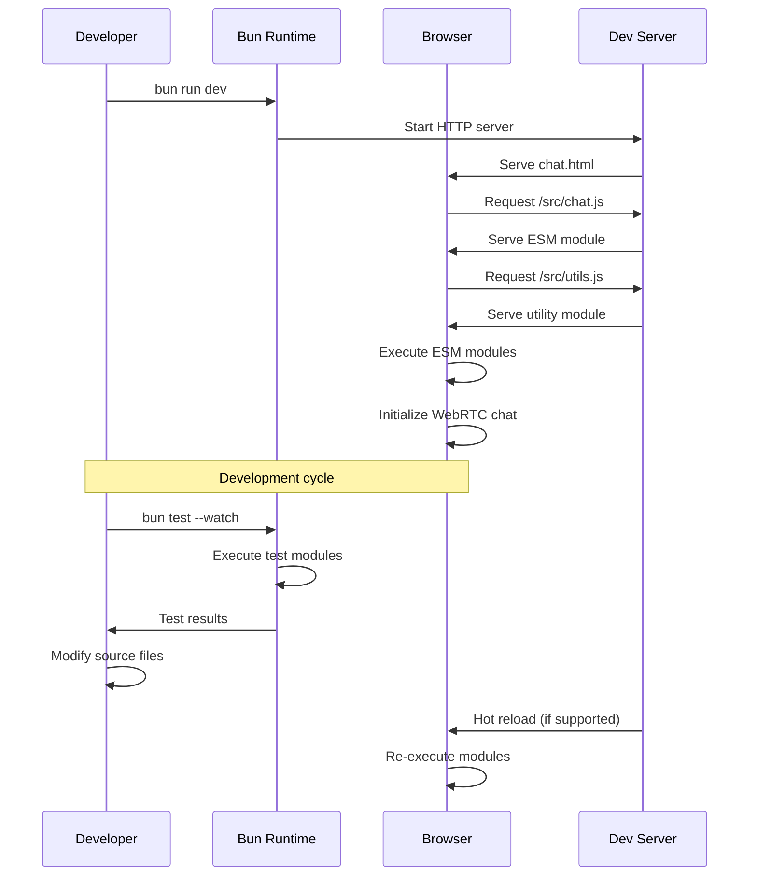

# Design Document

## Overview

This design outlines the migration of the existing WebRTC POC chat application from a single-file architecture to a Bun-based development environment with modular ESM structure. The migration maintains all existing functionality while introducing modern development tooling, improved code organization, and enhanced developer experience through Bun's fast runtime and native ESM support.

The core principle is to preserve the application's simplicity and functionality while modernizing the development workflow and code structure.

## Architecture

### Current State Analysis
The existing application is a single `chat.html` file containing:
- HTML structure with semantic markup
- Inline CSS with modern features (CSS Grid, Custom Properties, responsive design)
- Inline JavaScript with WebRTC/PeerJS functionality and comprehensive test suite
- External dependencies loaded via CDN (PeerJS library)

### Target Architecture
The migrated application will maintain the same runtime behavior but with separated concerns:

```
Project Structure:
├── chat.html                    # HTML entry point (no inline JS/CSS)
├── bunfig.toml                  # Bun configuration and scripts
├── package.json                 # Package management and script definitions
├── src/
│   ├── chat.js                  # Main application module (ESM)
│   ├── utils.js                 # Helper functions and utilities (ESM)
│   └── styles.css               # Extracted CSS styles
├── tests/
│   ├── utils.test.js            # Unit tests for utilities (ESM)
│   ├── chat.test.js             # Integration tests for chat functionality
│   └── dom.test.js              # DOM manipulation tests
└── .kiro/steering/              # Updated steering documentation
    ├── tech.md                  # Updated with Bun-specific commands
    ├── structure.md             # Updated project structure
    └── product.md               # Updated development methodology
```

## Components and Interfaces

### 1. Bun Configuration (`bunfig.toml`)

```toml
[install]
# Bun package management configuration
registry = "https://registry.npmjs.org/"
cache = true

[run]
# Development server configuration
bun = "latest"

[test]
# Test runner configuration
preload = []
timeout = 30000
```

**Scripts Definition:**
- `dev`: Start development server with hot reload
- `test`: Run test suite with watch mode
- `start`: Production server start
- `build`: Optional build step for optimization

### 2. HTML Entry Point (`chat.html`)

**Key Changes:**
- Remove all inline `<script>` tags
- Remove inline `<style>` tags
- Add module script reference: `<script type="module" src="/src/chat.js">`
- Add CSS link: `<link rel="stylesheet" href="/src/styles.css">`
- Maintain all existing DOM structure and IDs for compatibility

### 3. Main Application Module (`src/chat.js`)

**Responsibilities:**
- Application initialization and state management
- PeerJS integration and WebRTC connection handling
- Event listener setup and DOM manipulation
- Message handling and UI updates
- Test suite integration

**ESM Structure:**
```javascript
// External dependencies
import Peer from 'https://unpkg.com/peerjs@1.5.0/dist/peerjs.min.js';

// Internal modules
import { 
  formatTimestamp, 
  validatePeerId, 
  createSystemMessage,
  setupTestFramework 
} from './utils.js';

// Application state
const appState = {
  peer: null,
  connection: null,
  isConnected: false
};

// Main application functions
export function initializeApp() { /* ... */ }
export function setupPeerConnection() { /* ... */ }
export function handleMessage(data) { /* ... */ }

// Initialize when DOM is ready
document.addEventListener('DOMContentLoaded', initializeApp);
```

### 4. Utilities Module (`src/utils.js`)

**Responsibilities:**
- Pure utility functions for formatting and validation
- Test framework setup and execution
- DOM helper functions
- Message formatting utilities

**ESM Structure:**
```javascript
// Utility functions
export function formatTimestamp(date) { /* ... */ }
export function validatePeerId(id) { /* ... */ }
export function createSystemMessage(text) { /* ... */ }

// Test framework
export function setupTestFramework() { /* ... */ }
export function runTests() { /* ... */ }

// DOM utilities
export function getElementById(id) { /* ... */ }
export function addEventListenerSafe(element, event, handler) { /* ... */ }
```

### 5. Extracted Styles (`src/styles.css`)

**Content:**
- All existing CSS from the inline `<style>` block
- Maintain all current responsive design and modern CSS features
- Preserve CSS custom properties and mobile-first approach
- Keep all existing animations and transitions

### 6. Test Modules

**`tests/utils.test.js`:**
```javascript
import { formatTimestamp, validatePeerId, createSystemMessage } from '../src/utils.js';

// Test suites using Bun's native test runner
import { test, expect, describe } from 'bun:test';

describe('Utility Functions', () => {
  test('formatTimestamp should format dates correctly', () => {
    // Test implementation
  });
  
  test('validatePeerId should validate peer IDs', () => {
    // Test implementation
  });
});
```

## Data Models

### Application State Model
```javascript
interface AppState {
  peer: Peer | null;           // PeerJS instance
  connection: DataConnection | null;  // Active peer connection
  isConnected: boolean;        // Connection status
  myId: string | null;         // Local peer ID
  remoteId: string | null;     // Remote peer ID
  messages: Message[];         // Chat message history
}

interface Message {
  id: string;
  text: string;
  timestamp: Date;
  type: 'user' | 'system' | 'peer';
  sender?: string;
}
```

### Configuration Model
```javascript
interface PackageConfig {
  name: string;
  version: string;
  type: "module";
  scripts: {
    dev: string;
    test: string;
    start: string;
  };
  dependencies?: Record<string, string>;
  devDependencies?: Record<string, string>;
}

interface BunConfig {
  install: {
    registry: string;
    cache: boolean;
  };
  run: {
    bun: string;
  };
  test: {
    preload: string[];
    timeout: number;
  };
}
```

## Error Handling

### Module Loading Errors
- Graceful fallback if ESM modules fail to load
- Clear error messages for unsupported browsers
- Fallback to CDN resources if local modules unavailable

### WebRTC Connection Errors
- Maintain existing error handling patterns
- Enhanced error reporting with module-specific context
- Preserve all existing connection retry logic

### Test Execution Errors
- Bun test runner error handling
- Module import error recovery
- Test isolation and cleanup

## Testing Strategy

### Test Migration Approach
1. **Preserve Existing Tests**: All current test logic maintained
2. **ESM Conversion**: Convert `require()` to `import` statements
3. **Bun Integration**: Utilize Bun's native test runner features
4. **Module Testing**: Add tests for module boundaries and exports

### Test Categories

**Unit Tests (`tests/utils.test.js`):**
- Pure utility function testing
- Input validation and edge cases
- Format and transformation functions

**Integration Tests (`tests/chat.test.js`):**
- PeerJS integration testing
- WebRTC connection workflows
- Message handling end-to-end

**DOM Tests (`tests/dom.test.js`):**
- DOM manipulation functions
- Event handler registration
- UI state updates

### Test Execution
- **Development**: `bun test --watch` for continuous testing
- **CI/CD**: `bun test` for single-run execution
- **Coverage**: Maintain 100% code coverage requirement

## Development Workflow

### Bun Development Server
```bash
# Start development server
bun run dev
# Equivalent to: bun run --bun http-server --port=3000 --dir=./
```

**Features:**
- Fast startup (<100ms)
- Static file serving
- Module resolution
- Hot reload capability (if supported)

### Module Development
1. **ESM-First**: All modules use native ESM syntax
2. **Import Maps**: Leverage browser-native import resolution
3. **No Transpilation**: Direct browser execution of modern JavaScript
4. **Tree Shaking**: Natural dead code elimination through ESM

### Testing Workflow
```bash
# Watch mode for development
bun test --watch

# Single run for CI
bun test

# Specific test file
bun test tests/utils.test.js
```

## Migration Sequence Diagram



## Performance Considerations

### Bun Runtime Benefits
- **Fast Startup**: Sub-100ms development server startup
- **Native ESM**: No transpilation overhead
- **Efficient Testing**: Fast test execution with native runner
- **Memory Efficiency**: Optimized JavaScript runtime

### Browser Performance
- **Module Caching**: Browser-native ESM caching
- **Reduced Bundle Size**: No build artifacts or polyfills
- **Lazy Loading**: Potential for dynamic imports
- **Network Optimization**: HTTP/2 server push for modules

### Development Experience
- **Hot Reload**: Fast feedback cycles
- **Watch Mode**: Automatic test re-execution
- **Error Reporting**: Enhanced stack traces with source maps
- **Debugging**: Native browser debugging support

## Security Considerations

### Module Security
- **ESM Integrity**: Native browser module validation
- **CORS Compliance**: Proper cross-origin resource sharing
- **Content Security Policy**: Compatible with CSP restrictions
- **Dependency Management**: Controlled external dependencies

### WebRTC Security
- **Maintain HTTPS**: Preserve existing HTTPS requirements
- **Peer Validation**: Keep existing peer ID validation
- **Connection Security**: Maintain WebRTC security practices
- **Data Sanitization**: Preserve message sanitization

## Steering Documentation Updates

### Updated Technology Stack (tech.md)
The steering documentation must be updated to reflect the new Bun-based development environment:

**Key Changes:**
- Replace Node.js references with Bun v1.x
- Update development commands to use `bun run` instead of `npm`/`yarn`
- Add Bun-specific testing commands
- Update build and deployment instructions
- Include ESM module development guidelines

**New Commands Section:**
```bash
# Development with Bun
bun run dev                      # Start development server
bun test --watch                 # Run tests in watch mode
bun install                      # Install dependencies

# Git Operations (unchanged)
git log --oneline                # View commit history
git add <files>                  # Stage specific files
git commit -m "message"          # Commit with message
```

### Updated Project Structure (structure.md)
The structure documentation must reflect the new modular architecture:

**Key Changes:**
- Document the new `src/` directory structure
- Explain ESM module organization
- Update file responsibility descriptions
- Include Bun configuration files
- Maintain single-file deployment capability

### Updated Product Overview (product.md)
The product documentation should reflect the enhanced development methodology:

**Key Changes:**
- Emphasize modern ESM development approach
- Highlight Bun's performance benefits
- Update the technical approach section
- Maintain focus on simplicity and portability

## Deployment Strategy

### Development Deployment
- Local development server via Bun
- File watching and hot reload
- Test integration and continuous feedback

### Production Deployment
- Static file serving (no build step required)
- CDN compatibility for global distribution
- GitHub Pages compatibility maintained
- Docker containerization option with Bun runtime

### Rollback Strategy
- Git-based rollback to single-file version
- Feature flag for ESM vs inline script loading
- Gradual migration with compatibility layer