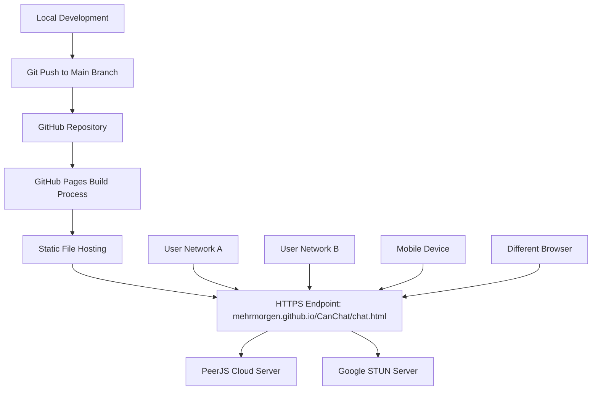
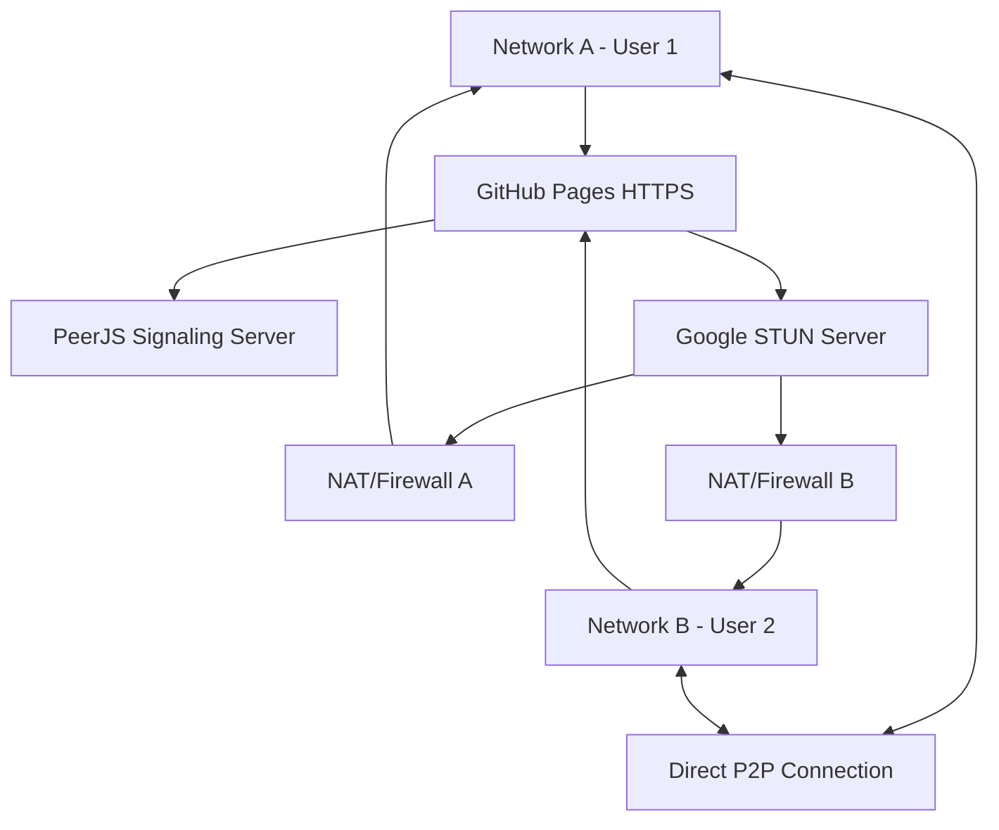

# Design Document

## Overview

The GitHub Pages deployment feature enables the WebRTC PeerJS Chat application to be hosted on GitHub's static hosting service, making it accessible via HTTPS at https://mehrmorgen.github.io/CanChat/chat.html. This deployment is essential for WebRTC functionality as modern browsers require HTTPS for WebRTC APIs in production environments. The deployment allows for real-world testing across different networks, devices, and browsers.

## Architecture

### Deployment Architecture



The deployment architecture follows GitHub Pages' static hosting model:

1. **Source Control**: Code changes pushed to main branch trigger automatic deployment
2. **Build Process**: GitHub Pages automatically serves static files without build steps
3. **HTTPS Delivery**: GitHub provides SSL/TLS certificates for secure WebRTC access
4. **Global CDN**: GitHub's CDN ensures fast loading times across different networks

### Network Testing Architecture



## Components and Interfaces

### Core Components

#### 1. GitHub Pages Configuration

**Responsibility**: Manages static file hosting and HTTPS delivery

- Serves chat.html file directly from repository
- Provides HTTPS endpoint required for WebRTC
- Handles automatic deployment on code changes
- Manages caching and CDN distribution

#### 2. Repository Structure

**Responsibility**: Organizes files for GitHub Pages deployment

- Single HTML file deployment model
- No build process or compilation required
- Direct file serving from repository root or docs folder
- Version control integration for deployment tracking

#### 3. Network Compatibility Layer

**Responsibility**: Ensures WebRTC works across different network configurations

- HTTPS requirement satisfaction for WebRTC APIs
- STUN server configuration for NAT traversal
- Cross-origin resource sharing (CORS) handling
- Mobile and desktop browser compatibility

### Interface Definitions

#### GitHub Pages Configuration Interface

```yaml
# Repository Settings Configuration
pages:
  source: 
    branch: main
    path: /
  custom_domain: null
  https_enforcement: true
  build_type: static
```

#### Deployment Status Interface

```javascript
// Deployment monitoring
{
  status: 'success' | 'building' | 'failed',
  url: 'https://mehrmorgen.github.io/CanChat/chat.html',
  lastDeployed: Date,
  commitSha: string,
  buildLog: string[]
}
```

#### Network Testing Interface

```javascript
// Cross-network testing capabilities
{
  httpsEnabled: boolean,
  webrtcSupported: boolean,
  stunServerReachable: boolean,
  peerJsConnected: boolean,
  natTraversalWorking: boolean
}
```

## Data Models

### Deployment Configuration Model

```javascript
// GitHub Pages deployment settings
{
  repository: 'mehrmorgen/CanChat',
  branch: 'main',
  path: '/',
  customDomain: null,
  httpsEnforced: true,
  buildType: 'static',
  url: 'https://mehrmorgen.github.io/CanChat/chat.html'
}
```

### Network Test Session Model

```javascript
// Multi-network testing session
{
  sessionId: string,
  participants: [
    {
      peerId: string,
      network: string,
      browser: string,
      device: string,
      connected: boolean
    }
  ],
  connectionEstablished: boolean,
  messagesExchanged: number,
  sessionDuration: number,
  errors: string[]
}
```

### Performance Metrics Model

```javascript
// Deployment performance tracking
{
  pageLoadTime: number,
  timeToFirstByte: number,
  connectionEstablishmentTime: number,
  messageLatency: number,
  memoryUsage: number,
  networkBandwidth: number
}
```

## Error Handling

### Deployment Errors

- **Build Failures**: GitHub Pages build process errors with detailed logs
- **File Not Found**: Handle missing chat.html file in repository
- **Configuration Issues**: Invalid GitHub Pages settings or branch configuration
- **SSL Certificate Issues**: HTTPS certificate provisioning or renewal problems

### Network-Specific Errors

- **HTTPS Required**: Clear messaging when WebRTC APIs are blocked on HTTP
- **NAT Traversal Failures**: Specific error messages for firewall/network restrictions
- **STUN Server Unreachable**: Fallback messaging when Google STUN server is blocked
- **Cross-Origin Issues**: Handle any CORS-related problems with external resources

### Browser Compatibility Errors

- **Legacy Browser Detection**: Clear blocking message for browsers below minimum versions
- **Modern Mobile Requirements**: Enforce recent mobile browser versions only
- **Safari Modern Features**: Use Safari 14+ specific WebRTC improvements
- **No Legacy Fallbacks**: Direct users to upgrade rather than providing degraded experience

## Testing Strategy

### Deployment Testing

#### Automated Deployment Verification

- **Build Success**: Verify GitHub Pages build completes without errors
- **File Accessibility**: Confirm chat.html is accessible via HTTPS URL
- **Resource Loading**: Validate all CDN resources (PeerJS, Jest) load correctly
- **HTTPS Enforcement**: Ensure HTTP requests redirect to HTTPS

#### Manual Deployment Testing

- **URL Accessibility**: Manual verification of https://mehrmorgen.github.io/CanChat/chat.html
- **Page Load Performance**: Test loading times from different geographic locations
- **Mobile Responsiveness**: Verify mobile browser compatibility and performance
- **Cross-Browser Testing**: Test deployment across Chrome, Firefox, Safari

### Network Testing Strategy

#### Multi-Network Connection Testing

1. **Same Network Testing**: Verify P2P connections work within same network
2. **Different Network Testing**: Test connections across different ISPs/networks
3. **Mobile/WiFi Testing**: Test mobile device connections to desktop peers
4. **Corporate Network Testing**: Verify functionality through corporate firewalls

#### Real-World Scenario Testing

1. **Geographic Distribution**: Test connections across different countries/regions
2. **Network Quality Variations**: Test on different bandwidth/latency conditions
3. **NAT Configuration Testing**: Test various NAT types and firewall configurations
4. **Extended Session Testing**: Verify stability over long chat sessions

### Performance Testing

#### Load Testing

- **Concurrent Users**: Test multiple simultaneous users accessing the deployment
- **Resource Usage**: Monitor server resource usage during peak access
- **CDN Performance**: Verify GitHub's CDN delivers content efficiently
- **Caching Behavior**: Test browser caching and cache invalidation

#### Network Performance Testing

- **Connection Establishment Time**: Measure time to establish P2P connections
- **Message Latency**: Test real-time message delivery across networks
- **Bandwidth Usage**: Monitor data usage for different usage patterns
- **Memory Stability**: Verify no memory leaks during extended usage

## Implementation Notes

### GitHub Pages Configuration

#### Repository Setup

- **Pages Source**: Configure to deploy from main branch root directory
- **HTTPS Enforcement**: Enable HTTPS enforcement in repository settings
- **Custom Domain**: Not required for this deployment (using github.io subdomain)
- **Build Process**: Static deployment (no Jekyll or other build tools)

#### File Organization

```
Repository Root:
├── chat.html                 # Main application file
├── README.md                 # Repository documentation
├── .gitignore               # Git ignore rules
└── .kiro/                   # Kiro IDE configuration (not deployed)
```

### Security Considerations

#### HTTPS Requirements

- **WebRTC APIs**: Modern browsers require HTTPS for getUserMedia and RTCPeerConnection
- **Secure Contexts**: All WebRTC functionality requires secure context (HTTPS)
- **Mixed Content**: Ensure all external resources (PeerJS, STUN) use HTTPS
- **Certificate Management**: GitHub handles SSL certificate provisioning automatically

#### Network Security

- **STUN Server Security**: Google STUN server provides no authentication (by design)
- **PeerJS Security**: Uses PeerJS cloud server for signaling (no additional security)
- **Message Encryption**: WebRTC provides built-in encryption for data channels
- **No Authentication**: Application intentionally provides no user authentication

### Performance Optimization

#### Static Asset Optimization

- **Single File Deployment**: Minimizes HTTP requests and deployment complexity, no build process
- **CDN Resources**: External libraries loaded from CDNs for better caching, modern versions only
- **Inline Modern CSS**: CSS Grid, Flexbox, Custom Properties included inline without prefixes
- **Minimal Dependencies**: Only essential external resources, no legacy compatibility libraries

#### Network Optimization

- **STUN Server Selection**: Google STUN servers chosen for reliability and global availability
- **PeerJS Configuration**: Default PeerJS cloud server for optimal signaling performance
- **Connection Pooling**: Single connection model reduces resource usage
- **Message Batching**: Not implemented (real-time messaging prioritized)

### Browser Compatibility

#### Primary Support Targets

- **Chrome/Chromium 88+**: Native ES2020+ and modern WebRTC APIs, primary testing target
- **Firefox 85+**: Native modern JavaScript and WebRTC support, secondary testing target  
- **Safari 14+**: Native WebRTC and ES2020+ support, tertiary target
- **Modern Mobile Browsers**: iOS Safari 14+ and Android Chrome 88+ only, no legacy mobile support

#### Compatibility Handling

- **Modern API Usage**: Use latest WebRTC and ES2020+ APIs without feature detection or transpilation
- **Clear Requirements**: Upfront messaging about modern browser requirements with specific version numbers
- **No Legacy Support**: Explicitly no polyfills, shims, Babel, or fallbacks for older browsers
- **Version Enforcement**: Hard block access for browsers below minimum versions with upgrade guidance

### Monitoring and Maintenance

#### Deployment Monitoring

- **GitHub Actions**: Monitor deployment status through GitHub's interface
- **Error Tracking**: Review GitHub Pages build logs for deployment issues
- **Uptime Monitoring**: GitHub Pages provides high availability (no additional monitoring needed)
- **Performance Monitoring**: Use browser dev tools for performance analysis

#### Maintenance Procedures

- **Code Updates**: Push to main branch triggers automatic redeployment
- **Dependency Updates**: Update CDN URLs for library version changes
- **Security Updates**: Monitor for security advisories affecting dependencies
- **Performance Reviews**: Periodic performance testing and optimization

### Development Workflow Integration

#### Git Integration

- **Branch Strategy**: Deploy from main branch only
- **Commit Messages**: Clear commit messages for deployment tracking
- **Version Tagging**: Optional version tags for release tracking
- **Rollback Strategy**: Git revert for quick rollback if needed

#### Testing Integration

- **Pre-deployment Testing**: Local testing before pushing to main
- **Post-deployment Verification**: Manual testing after each deployment
- **Continuous Testing**: Regular cross-network testing schedule
- **Issue Tracking**: GitHub Issues for deployment and functionality problems