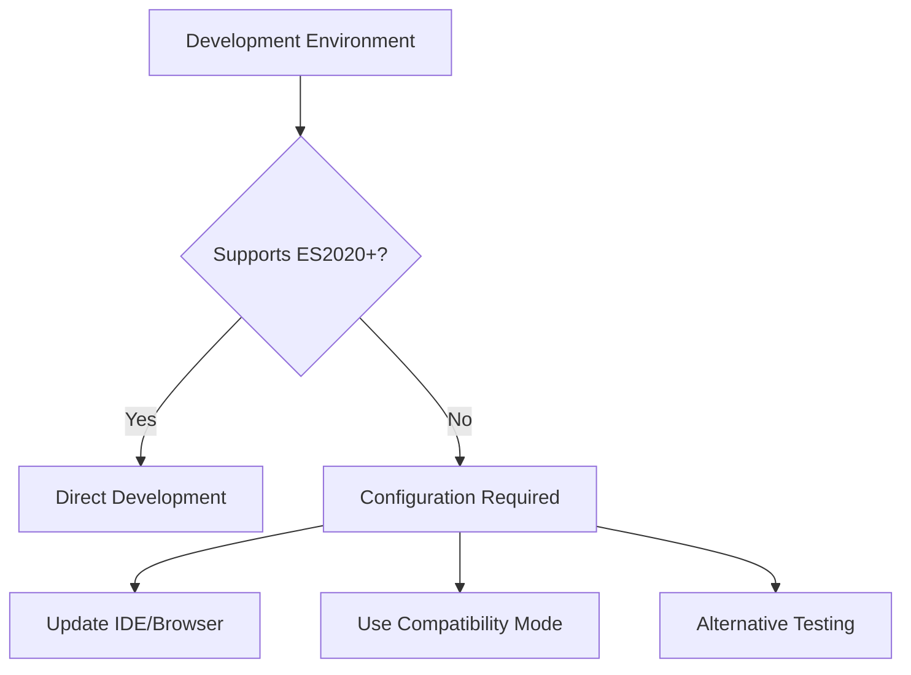

# Design Document

## Overview

The JavaScript syntax compatibility system implements the most modern JavaScript features and APIs available in current
versions of Firefox, Safari, and Chrome. This system leverages cutting-edge browser capabilities including ES2020+
syntax, modern WebRTC APIs, advanced asynchronous patterns, and the latest DOM/Web APIs to provide the best possible
user experience. The design prioritizes native browser APIs over polyfills and focuses exclusively on modern browser
support with comprehensive testing for syntax compatibility and development environment solutions.

## Architecture

### Modern Browser Detection Strategy

The application uses a multi-layered approach to ensure only modern browsers can run the code:

1. **Syntax-Level Blocking**: ES2020+ syntax causes immediate parse errors in legacy browsers
2. **Feature Detection**: Runtime validation of modern JavaScript features
3. **API Validation**: Verification of required browser APIs (WebRTC, modern DOM features)

### Development Environment Compatibility



## Components and Interfaces

### 1. Modern JavaScript Feature Implementation

**Purpose**: Implements the latest JavaScript features available in current browsers

```javascript
const modernJavaScriptFeatures = {
    // ES2020+ Syntax Features
    optionalChaining: {
        example: () => user?.profile?.settings?.theme,
        usage: 'Safe property access without explicit null checks'
    },
    
    nullishCoalescing: {
        example: () => config.timeout ?? 5000,
        usage: 'Default values only for null/undefined, not falsy values'
    },
    
    // Modern Promise Features
    promiseAllSettled: {
        example: async () => {
            const results = await Promise.allSettled([
                fetchUserData(),
                fetchSettings(),
                fetchPreferences()
            ]);
            return results.filter(r => r.status === 'fulfilled');
        },
        usage: 'Handle multiple async operations with individual error handling'
    },
    
    // Private Class Fields
    privateFields: {
        example: class Connection {
            #privateKey;
            #isConnected = false;
            
            constructor(key) {
                this.#privateKey = key;
            }
            
            get isConnected() {
                return this.#isConnected;
            }
        },
        usage: 'True private class members for encapsulation'
    },
    
    // Top-level await
    topLevelAwait: {
        example: 'const config = await import("./config.js");',
        usage: 'Await at module top level for initialization'
    },
    
```

### 5. Development Mode Handler

**Purpose**: Provides alternative implementations for development environments

```javascript
const developmentModeHandler = {
    // Alternative to optional chaining for development
    safeAccess: (obj, path) => {
        return path.split('.').reduce((current, key) => {
            return current && current[key] !== undefined ? current[key] : undefined;
        }, obj);
    },
    
    // Alternative to nullish coalescing
    nullishDefault: (value, defaultValue) => {
        return value !== null && value !== undefined ? value : defaultValue;
    },
    
    // Alternative to modern array methods
    modernArrayAlternatives: {
        flatMap: (array, callback) => {
            return array.reduce((acc, item, index) => {
                const result = callback(item, index, array);
                return acc.concat(Array.isArray(result) ? result : [result]);
            }, []);
        },
        
        structuredCloneAlternative: (obj) => {
            return JSON.parse(JSON.stringify(obj));
        }
    }
};
```

### 6. Modern Testing Patterns and Development Tools

**Purpose**: Implements cutting-edge testing patterns using native browser capabilities

```javascript
const modernTestingFeatures = {
    // Native Browser Testing
    nativeTesting: {
        example: () => {
            // Using modern assertion patterns
            const assert = (condition, message) => {
                if (!condition) throw new Error(message);
            };
            
            // Modern test structure with async/await
            const runTest = async (testName, testFn) => {
                try {
                    await testFn();
                    console.log(`✓ ${testName}`);
                } catch (error) {
                    console.error(`✗ ${testName}: ${error.message}`);
                }
            };
        },
        usage: 'Native browser testing without external frameworks'
    },
    
    // Modern Mocking and Validation
    modernValidation: {
        example: () => {
            // Using modern JavaScript features for validation
            const validateData = (data) => {
                const schema = {
                    required: ['id', 'name'],
                    optional: ['email', 'phone']
                };
                
                return schema.required.every(field => 
                    data?.[field] !== undefined && data[field] !== null
                );
            };
        },
        usage: 'Modern validation patterns with optional chaining'
    },
    
    // Current Browser Developer Tools Integration
    debuggingAPIs: {
        example: () => {
            // Using modern debugging APIs
            performance.mark('operation-start');
            // ... operation code ...
            performance.mark('operation-end');
            performance.measure('operation', 'operation-start', 'operation-end');
            
            // Modern error reporting
            window.addEventListener('unhandledrejection', event => {
                console.error('Unhandled promise rejection:', event.reason);
            });
        },
        usage: 'Integration with current browser developer tools'
    }
};
```

### 7. Environment Configuration Manager

**Purpose**: Manages different configurations for development vs production

```javascript
const environmentConfig = {
    isDevelopment: window.location.hostname === 'localhost' || 
                   window.location.protocol === 'file:',
    
    getCompatibilityMode: () => {
        // Check if we need compatibility mode
        const syntaxSupport = detectSyntaxSupport();
        return !syntaxSupport.optionalChaining || !syntaxSupport.nullishCoalescing;
    }
};
```

## Data Models

### Syntax Support Model

```javascript
{
    optionalChaining: boolean,      // obj?.prop support
    nullishCoalescing: boolean,     // null ?? default support
    bigInt: boolean,                // BigInt support
    promiseAllSettled: boolean,     // Promise.allSettled support
    stringMatchAll: boolean,        // String.matchAll support
    dynamicImport: boolean          // import() support
}
```

### Development Environment Model

```javascript
{
    isDevelopment: boolean,         // Development vs production
    compatibilityMode: boolean,     // Need compatibility shims
    browserInfo: {
        name: string,
        version: number,
        isSupported: boolean
    },
    ideSupport: {
        syntaxHighlighting: boolean,
        errorReporting: boolean,
        autocompletion: boolean
    }
}
```

## Error Handling

### Syntax Error Resolution

#### Common Error: "',' expected"

**Cause**: IDE or browser doesn't recognize optional chaining syntax

**Solutions**:

1. **Update Browser**: Use Chrome 80+, Firefox 72+, or Safari 13.1+
2. **Update IDE**: Configure for ES2020+ support
3. **Use Compatibility Mode**: Temporary workaround for development

#### Common Error: "Unexpected token '?'"

**Cause**: JavaScript parser doesn't support nullish coalescing

**Solutions**:

1. **Parser Configuration**: Update JavaScript language level
2. **Babel Configuration**: Add appropriate presets for development
3. **Alternative Syntax**: Use compatibility functions during development

### Development Environment Setup

#### IDE Configuration

**VS Code**:

```json
{
    "typescript.preferences.includePackageJsonAutoImports": "on",
    "javascript.preferences.includePackageJsonAutoImports": "on",
    "typescript.suggest.autoImports": true,
    "javascript.suggest.autoImports": true,
    "typescript.updateImportsOnFileMove.enabled": "always",
    "javascript.updateImportsOnFileMove.enabled": "always",
    "typescript.preferences.importModuleSpecifier": "relative",
    "javascript.preferences.importModuleSpecifier": "relative",
    "emmet.includeLanguages": {
        "javascript": "javascriptreact"
    },
    "javascript.validate.enable": true,
    "typescript.validate.enable": true
}
```

**WebStorm/IntelliJ**:

- Set JavaScript language version to ES2020 or later
- Enable "Use strict mode" in JavaScript settings
- Configure code style for modern JavaScript features

#### Browser Configuration

**Chrome/Chromium**: Version 80+ (January 2020)
**Firefox**: Version 72+ (January 2020)  
**Safari**: Version 13.1+ (March 2020)
**Edge**: Version 80+ (February 2020)

### Compatibility Shims for Development

```javascript
// Development-only compatibility layer
if (environmentConfig.isDevelopment && environmentConfig.getCompatibilityMode()) {
    // Polyfill optional chaining behavior
    window.optionalChain = (obj, path) => {
        try {
            return path.split('.').reduce((current, key) => {
                return current?.[key];
            }, obj);
        } catch {
            return undefined;
        }
    };
    
    // Polyfill nullish coalescing behavior
    window.nullishCoalesce = (value, defaultValue) => {
        return value ?? defaultValue;
    };
}
```

## Testing Strategy

### Modern JavaScript Feature Testing

#### ES2020+ Syntax Support Tests

```javascript
describe('Modern JavaScript Features', () => {
    test('should support optional chaining', () => {
        expect(() => {
            const result = {}?.test?.property;
        }).not.toThrow();
    });
    
    test('should support nullish coalescing', () => {
        expect(() => {
            const result = null ?? 'default';
        }).not.toThrow();
    });
    
    test('should support private class fields', () => {
        expect(() => {
            class TestClass {
                #private = 'test';
                getPrivate() { return this.#private; }
            }
            new TestClass().getPrivate();
        }).not.toThrow();
    });
    
    test('should support modern array methods', () => {
        expect([1, 2].flatMap(x => [x, x * 2])).toEqual([1, 2, 2, 4]);
        expect(typeof structuredClone).toBe('function');
    });
});
```

### WebRTC and Browser API Testing

#### Modern WebRTC Feature Tests

```javascript
describe('Modern WebRTC APIs', () => {
    test('should support latest RTCPeerConnection features', () => {
        const pc = new RTCPeerConnection({
            iceServers: [{ urls: 'stun:stun.l.google.com:19302' }]
        });
        expect(pc).toBeInstanceOf(RTCPeerConnection);
        expect(typeof pc.addTransceiver).toBe('function');
    });
    
    test('should support modern MediaDevices API', () => {
        expect(navigator.mediaDevices).toBeDefined();
        expect(typeof navigator.mediaDevices.getUserMedia).toBe('function');
    });
    
    test('should support AbortController for event handling', () => {
        const controller = new AbortController();
        expect(controller.signal).toBeInstanceOf(AbortSignal);
    });
});
```

### Asynchronous Pattern Testing

#### Modern Async/Await and Promise Tests

```javascript
describe('Modern Asynchronous Patterns', () => {
    test('should support Promise.allSettled', async () => {
        const results = await Promise.allSettled([
            Promise.resolve('success'),
            Promise.reject('error')
        ]);
        expect(results).toHaveLength(2);
        expect(results[0].status).toBe('fulfilled');
        expect(results[1].status).toBe('rejected');
    });
    
    test('should handle AggregateError', () => {
        expect(() => {
            throw new AggregateError([new Error('test')], 'Multiple errors');
        }).toThrow(AggregateError);
    });
    
    test('should support async generators', async () => {
        async function* testGenerator() {
            yield 1;
            yield 2;
        }
        
        const gen = testGenerator();
        const first = await gen.next();
        expect(first.value).toBe(1);
    });
});
```

### DOM and Web API Testing

#### Modern DOM Method Tests

```javascript
describe('Modern DOM and Web APIs', () => {
    test('should support modern DOM methods', () => {
        const element = document.createElement('div');
        expect(typeof element.replaceChildren).toBe('function');
        expect(typeof element.toggleAttribute).toBe('function');
        expect(typeof element.closest).toBe('function');
    });
    
    test('should support IndexedDB with modern patterns', () => {
        expect(typeof indexedDB.open).toBe('function');
        expect(indexedDB).toBeDefined();
    });
    
    test('should support Intersection Observer', () => {
        expect(typeof IntersectionObserver).toBe('function');
    });
});
```

### Native Browser Testing Framework

#### Modern Testing Implementation

```javascript
describe('Native Browser Testing Capabilities', () => {
    test('should run tests natively in browser', () => {
        const testRunner = {
            async runTest(name, testFn) {
                try {
                    await testFn();
                    return { name, status: 'passed' };
                } catch (error) {
                    return { name, status: 'failed', error: error.message };
                }
            }
        };
        
        expect(typeof testRunner.runTest).toBe('function');
    });
    
    test('should integrate with browser developer tools', () => {
        performance.mark('test-start');
        performance.mark('test-end');
        performance.measure('test-duration', 'test-start', 'test-end');
        
        const measures = performance.getEntriesByType('measure');
        expect(measures.length).toBeGreaterThan(0);
    });
});
```

## Implementation Notes

### Why Optional Chaining is Used

The application intentionally uses ES2020+ syntax for several reasons:

1. **Modern Browser Enforcement**: Ensures only browsers with full WebRTC support can run the code
2. **Security**: Modern browsers have better security features required for WebRTC
3. **Performance**: Modern JavaScript engines provide better performance
4. **Maintenance**: Reduces complexity by not supporting legacy browsers

### Development Workflow

1. **Use Modern Browser**: Develop with Chrome 80+, Firefox 72+, or Safari 13.1+
2. **Configure IDE**: Set JavaScript language level to ES2020+
3. **Test Compatibility**: Verify modern browser detection works correctly
4. **Validate Legacy Blocking**: Confirm legacy browsers are properly blocked

### Production Behavior

In production (GitHub Pages), the ES2020+ syntax serves as the first line of defense:

1. **Modern Browsers**: Parse and execute code normally
2. **Legacy Browsers**: Encounter syntax errors immediately
3. **Error Handling**: Syntax errors trigger browser upgrade warnings
4. **User Experience**: Clear guidance to upgrade to supported browsers

### Alternative Solutions

If you absolutely need to work in an environment that doesn't support ES2020+:

1. **Use Compatibility Mode**: Implement conditional compilation
2. **Transpile for Development**: Use Babel to transpile during development only
3. **Mock Legacy Environment**: Test legacy browser blocking in supported browsers
4. **Update Environment**: Recommended solution - upgrade to modern tools

The recommended approach is to update your development environment to support ES2020+ features, as this aligns with the application's design goals and ensures you're working with the same syntax that will run in production.
