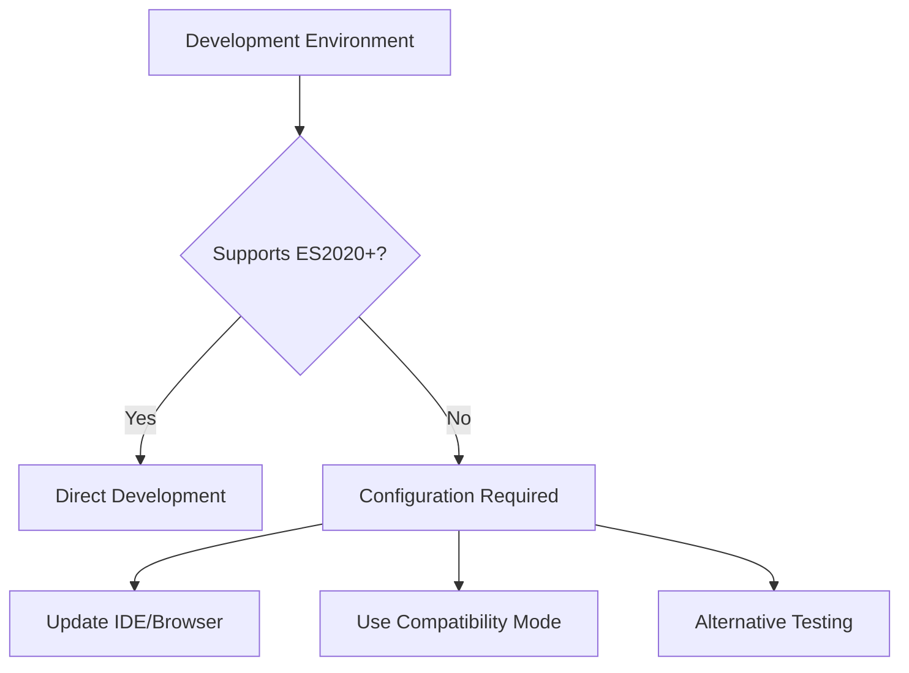

# Design Document

## Overview

The JavaScript syntax compatibility system addresses development environment issues while maintaining the production behavior of using ES2020+ features for modern browser detection. The application intentionally uses optional chaining (`?.`) and other modern syntax to automatically block legacy browsers, but this can cause issues in development environments that don't support these features.

## Architecture

### Modern Browser Detection Strategy

The application uses a multi-layered approach to ensure only modern browsers can run the code:

1. **Syntax-Level Blocking**: ES2020+ syntax causes immediate parse errors in legacy browsers
2. **Feature Detection**: Runtime validation of modern JavaScript features
3. **API Validation**: Verification of required browser APIs (WebRTC, modern DOM features)

### Development Environment Compatibility



## Components and Interfaces

### 1. Syntax Compatibility Detector

**Purpose**: Identifies which ES2020+ features are causing issues

```javascript
const detectSyntaxSupport = () => {
    const features = {
        optionalChaining: false,
        nullishCoalescing: false,
        bigInt: false,
        promiseAllSettled: false,
        stringMatchAll: false
    };
    
    try {
        // Test optional chaining
        eval('({})?.test?.property');
        features.optionalChaining = true;
    } catch (e) {
        console.warn('Optional chaining not supported');
    }
    
    try {
        // Test nullish coalescing
        eval('null ?? "default"');
        features.nullishCoalescing = true;
    } catch (e) {
        console.warn('Nullish coalescing not supported');
    }
    
    return features;
};
```

### 2. Development Mode Handler

**Purpose**: Provides alternative implementations for development environments

```javascript
const developmentModeHandler = {
    // Alternative to optional chaining for development
    safeAccess: (obj, path) => {
        return path.split('.').reduce((current, key) => {
            return current && current[key] !== undefined ? current[key] : undefined;
        }, obj);
    },
    
    // Alternative to nullish coalescing
    nullishDefault: (value, defaultValue) => {
        return value !== null && value !== undefined ? value : defaultValue;
    }
};
```

### 3. Environment Configuration Manager

**Purpose**: Manages different configurations for development vs production

```javascript
const environmentConfig = {
    isDevelopment: window.location.hostname === 'localhost' || 
                   window.location.protocol === 'file:',
    
    getCompatibilityMode: () => {
        // Check if we need compatibility mode
        const syntaxSupport = detectSyntaxSupport();
        return !syntaxSupport.optionalChaining || !syntaxSupport.nullishCoalescing;
    }
};
```

## Data Models

### Syntax Support Model

```javascript
{
    optionalChaining: boolean,      // obj?.prop support
    nullishCoalescing: boolean,     // null ?? default support
    bigInt: boolean,                // BigInt support
    promiseAllSettled: boolean,     // Promise.allSettled support
    stringMatchAll: boolean,        // String.matchAll support
    dynamicImport: boolean          // import() support
}
```

### Development Environment Model

```javascript
{
    isDevelopment: boolean,         // Development vs production
    compatibilityMode: boolean,     // Need compatibility shims
    browserInfo: {
        name: string,
        version: number,
        isSupported: boolean
    },
    ideSupport: {
        syntaxHighlighting: boolean,
        errorReporting: boolean,
        autocompletion: boolean
    }
}
```

## Error Handling

### Syntax Error Resolution

#### Common Error: "',' expected"

**Cause**: IDE or browser doesn't recognize optional chaining syntax

**Solutions**:

1. **Update Browser**: Use Chrome 80+, Firefox 72+, or Safari 13.1+
2. **Update IDE**: Configure for ES2020+ support
3. **Use Compatibility Mode**: Temporary workaround for development

#### Common Error: "Unexpected token '?'"

**Cause**: JavaScript parser doesn't support nullish coalescing

**Solutions**:

1. **Parser Configuration**: Update JavaScript language level
2. **Babel Configuration**: Add appropriate presets for development
3. **Alternative Syntax**: Use compatibility functions during development

### Development Environment Setup

#### IDE Configuration

**VS Code**:
```json
{
    "typescript.preferences.includePackageJsonAutoImports": "on",
    "javascript.preferences.includePackageJsonAutoImports": "on",
    "typescript.suggest.autoImports": true,
    "javascript.suggest.autoImports": true,
    "typescript.updateImportsOnFileMove.enabled": "always",
    "javascript.updateImportsOnFileMove.enabled": "always",
    "typescript.preferences.importModuleSpecifier": "relative",
    "javascript.preferences.importModuleSpecifier": "relative",
    "emmet.includeLanguages": {
        "javascript": "javascriptreact"
    },
    "javascript.validate.enable": true,
    "typescript.validate.enable": true
}
```

**WebStorm/IntelliJ**:
- Set JavaScript language version to ES2020 or later
- Enable "Use strict mode" in JavaScript settings
- Configure code style for modern JavaScript features

#### Browser Configuration

**Chrome/Chromium**: Version 80+ (January 2020)
**Firefox**: Version 72+ (January 2020)  
**Safari**: Version 13.1+ (March 2020)
**Edge**: Version 80+ (February 2020)

### Compatibility Shims for Development

```javascript
// Development-only compatibility layer
if (environmentConfig.isDevelopment && environmentConfig.getCompatibilityMode()) {
    // Polyfill optional chaining behavior
    window.optionalChain = (obj, path) => {
        try {
            return path.split('.').reduce((current, key) => {
                return current?.[key];
            }, obj);
        } catch {
            return undefined;
        }
    };
    
    // Polyfill nullish coalescing behavior
    window.nullishCoalesce = (value, defaultValue) => {
        return value ?? defaultValue;
    };
}
```

## Testing Strategy

### Syntax Compatibility Testing

#### Feature Detection Tests

```javascript
describe('ES2020+ Syntax Support', () => {
    test('should support optional chaining', () => {
        expect(() => {
            const result = {}?.test?.property;
        }).not.toThrow();
    });
    
    test('should support nullish coalescing', () => {
        expect(() => {
            const result = null ?? 'default';
        }).not.toThrow();
    });
    
    test('should support BigInt', () => {
        expect(() => {
            const result = BigInt(123);
        }).not.toThrow();
    });
});
```

#### Browser Compatibility Tests

```javascript
describe('Browser Compatibility', () => {
    test('should detect modern browser features', () => {
        const features = detectSyntaxSupport();
        expect(features.optionalChaining).toBe(true);
        expect(features.nullishCoalescing).toBe(true);
    });
    
    test('should handle legacy browser gracefully', () => {
        // Mock legacy browser environment
        const originalEval = window.eval;
        window.eval = () => { throw new SyntaxError('Unexpected token'); };
        
        const features = detectSyntaxSupport();
        expect(features.optionalChaining).toBe(false);
        
        window.eval = originalEval;
    });
});
```

### Development Environment Tests

```javascript
describe('Development Environment', () => {
    test('should detect development mode', () => {
        expect(typeof environmentConfig.isDevelopment).toBe('boolean');
    });
    
    test('should provide compatibility mode when needed', () => {
        const compatMode = environmentConfig.getCompatibilityMode();
        expect(typeof compatMode).toBe('boolean');
    });
    
    test('should provide alternative implementations', () => {
        expect(typeof developmentModeHandler.safeAccess).toBe('function');
        expect(typeof developmentModeHandler.nullishDefault).toBe('function');
    });
});
```

## Implementation Notes

### Why Optional Chaining is Used

The application intentionally uses ES2020+ syntax for several reasons:

1. **Modern Browser Enforcement**: Ensures only browsers with full WebRTC support can run the code
2. **Security**: Modern browsers have better security features required for WebRTC
3. **Performance**: Modern JavaScript engines provide better performance
4. **Maintenance**: Reduces complexity by not supporting legacy browsers

### Development Workflow

1. **Use Modern Browser**: Develop with Chrome 80+, Firefox 72+, or Safari 13.1+
2. **Configure IDE**: Set JavaScript language level to ES2020+
3. **Test Compatibility**: Verify modern browser detection works correctly
4. **Validate Legacy Blocking**: Confirm legacy browsers are properly blocked

### Production Behavior

In production (GitHub Pages), the ES2020+ syntax serves as the first line of defense:

1. **Modern Browsers**: Parse and execute code normally
2. **Legacy Browsers**: Encounter syntax errors immediately
3. **Error Handling**: Syntax errors trigger browser upgrade warnings
4. **User Experience**: Clear guidance to upgrade to supported browsers

### Alternative Solutions

If you absolutely need to work in an environment that doesn't support ES2020+:

1. **Use Compatibility Mode**: Implement conditional compilation
2. **Transpile for Development**: Use Babel to transpile during development only
3. **Mock Legacy Environment**: Test legacy browser blocking in supported browsers
4. **Update Environment**: Recommended solution - upgrade to modern tools

The recommended approach is to update your development environment to support ES2020+ features, as this aligns with the application's design goals and ensures you're working with the same syntax that will run in production.