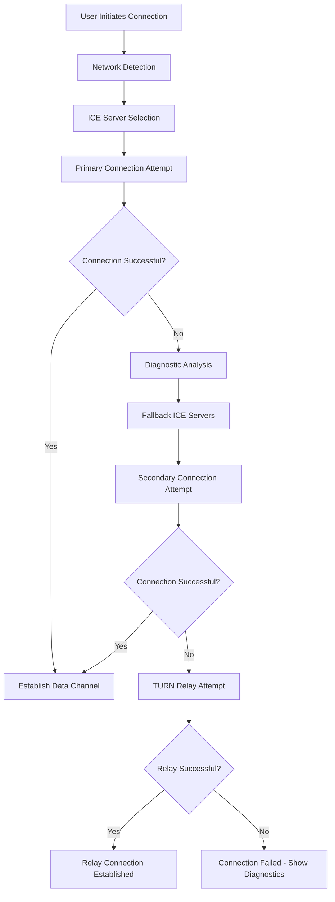

# Design Document

## Overview

This design addresses WebRTC connection reliability issues across different network types by implementing a robust ICE server configuration system, connection fallback mechanisms, and comprehensive diagnostics. The solution focuses on improving NAT traversal success rates while maintaining the peer-to-peer nature of the application.

## Architecture

### Connection Establishment Flow



### ICE Server Configuration Strategy

The system will use a tiered approach to ICE server selection:

1. **Tier 1 - Google STUN Servers**: Fast, reliable, free
2. **Tier 2 - Alternative STUN Servers**: Backup options for redundancy  
3. **Tier 3 - Free TURN Servers**: Limited bandwidth relay servers
4. **Tier 4 - Premium TURN Services**: High-quality relay with user guidance

## Components and Interfaces

### 1. Network Detection Module

```javascript
class NetworkDetector {
    async detectNetworkType()
    async measureLatency(servers)
    async testSTUNConnectivity(stunServers)
    getOptimalICEConfiguration()
}
```

**Responsibilities:**
- Detect if user is on mobile/cellular vs WiFi
- Test connectivity to various STUN/TURN servers
- Measure latency to different server endpoints
- Recommend optimal ICE server configuration

### 2. Connection Manager

```javascript
class ConnectionManager {
    async establishConnection(peerId, iceConfig)
    async attemptFallbackConnection(peerId)
    async establishTURNRelay(peerId)
    monitorConnectionQuality()
}
```

**Responsibilities:**
- Manage connection establishment with retry logic
- Handle fallback scenarios when primary connection fails
- Monitor connection quality and stability
- Provide connection state updates to UI

### 3. Diagnostics Engine

```javascript
class DiagnosticsEngine {
    logICECandidates(candidates)
    analyzeConnectionFailure(error, candidates)
    generateDiagnosticReport()
    suggestTroubleshooting(failureType)
}
```

**Responsibilities:**
- Log detailed connection attempt information
- Analyze failure patterns and root causes
- Generate user-friendly diagnostic reports
- Provide actionable troubleshooting suggestions

### 4. ICE Server Pool

```javascript
class ICEServerPool {
    getDefaultConfiguration()
    getFallbackConfiguration()
    getTURNConfiguration()
    validateServerHealth()
}
```

**Responsibilities:**
- Maintain pool of STUN/TURN servers
- Health check server availability
- Provide different configurations for different scenarios
- Handle server rotation and failover

## Data Models

### Connection Attempt

```javascript
{
    id: string,
    timestamp: Date,
    peerId: string,
    networkType: 'wifi' | 'cellular' | 'unknown',
    iceConfiguration: ICEConfiguration,
    candidates: ICECandidate[],
    result: 'success' | 'failed' | 'timeout',
    duration: number,
    failureReason?: string,
    diagnostics: DiagnosticData
}
```

### ICE Server Configuration

```javascript
{
    tier: 1 | 2 | 3 | 4,
    servers: [
        {
            urls: string[],
            username?: string,
            credential?: string,
            type: 'stun' | 'turn'
        }
    ],
    priority: number,
    healthStatus: 'healthy' | 'degraded' | 'failed'
}
```

### Diagnostic Data

```javascript
{
    networkType: string,
    stunConnectivity: boolean,
    turnConnectivity: boolean,
    candidateTypes: string[],
    selectedCandidatePair?: string,
    connectionTime: number,
    errorDetails?: string,
    suggestions: string[]
}
```

## Error Handling

### Connection Failure Types

1. **ICE Gathering Timeout**: No candidates found within timeout period
2. **Connectivity Check Failure**: Candidates found but connectivity checks fail
3. **STUN Server Unreachable**: Primary STUN servers not accessible
4. **Symmetric NAT**: Both peers behind symmetric NAT requiring TURN
5. **Firewall Blocking**: Corporate/restrictive firewall blocking WebRTC

### Error Recovery Strategies

- **Automatic Retry**: Retry with different ICE server configurations
- **Progressive Fallback**: Move through server tiers automatically
- **User Guidance**: Provide specific instructions based on failure type
- **Alternative Suggestions**: Recommend network changes or premium services

## Testing Strategy

### Unit Tests

- Network detection accuracy
- ICE server pool management
- Diagnostic analysis logic
- Connection retry mechanisms

### Integration Tests

- End-to-end connection establishment
- Fallback scenario handling
- Cross-network type connections
- Error recovery workflows

### Network Simulation Tests

- Symmetric NAT scenarios
- Firewall blocking simulation
- Server unavailability testing
- High latency/packet loss conditions

### Real-world Testing

- Mobile cellular to WiFi connections
- Corporate network environments
- Public WiFi scenarios
- International connection testing

## Performance Considerations

### Connection Timeout Strategy

- **Primary attempt**: 10 seconds maximum
- **Fallback attempts**: 8 seconds each
- **TURN relay**: 15 seconds maximum
- **Total timeout**: 45 seconds before giving up

### Resource Management

- Limit concurrent connection attempts to prevent resource exhaustion
- Clean up failed connection objects promptly
- Cache server health status to avoid repeated testing
- Implement exponential backoff for server retry attempts

### User Experience

- Show progress indicators during connection establishment
- Provide real-time status updates
- Display estimated time remaining for connection attempts
- Offer cancel option for long-running connection attempts

## Security Considerations

### TURN Server Security

- Use secure TURN servers (TURNS) when available
- Implement credential rotation for TURN authentication
- Validate TURN server certificates
- Monitor for credential leakage or abuse

### Connection Validation

- Verify peer identity before establishing data channels
- Implement connection fingerprinting to detect tampering
- Use secure random peer ID generation
- Validate ICE candidate authenticity

## Deployment Strategy

### Gradual Rollout

1. **Phase 1**: Enhanced diagnostics and logging
2. **Phase 2**: Improved ICE server configuration
3. **Phase 3**: Fallback connection mechanisms
4. **Phase 4**: TURN relay integration

### Configuration Management

- Environment-specific ICE server configurations
- Feature flags for different connection strategies
- A/B testing for connection success rates
- Monitoring and alerting for connection failures

### Monitoring and Analytics

- Track connection success rates by network type
- Monitor server health and performance
- Analyze failure patterns and common issues
- Measure user experience metrics (connection time, success rate)