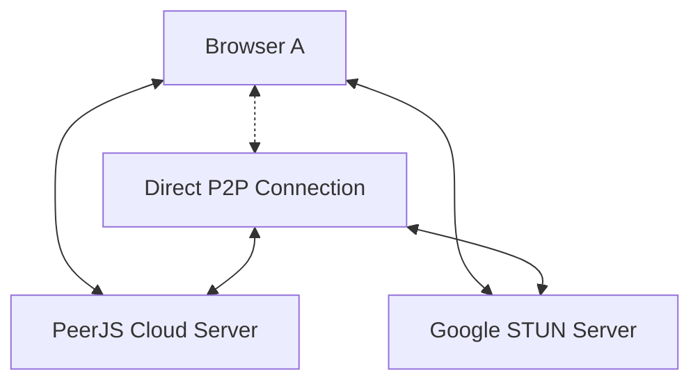

# Design Document

## Overview

The WebRTC PeerJS Chat application is a single-file HTML solution that enables direct peer-to-peer text communication between two browsers. The application leverages PeerJS for WebRTC abstraction and signaling, using PeerJS's public cloud server for peer discovery and Google's STUN servers for NAT traversal. The entire application is self-contained with no external dependencies or build processes required.

## Architecture

### High-Level Architecture



The architecture follows a simple peer-to-peer model:
1. **Signaling Phase**: Both peers connect to PeerJS cloud server to exchange connection metadata
2. **NAT Traversal**: Google STUN server helps establish direct connection through NATs/firewalls
3. **Direct Communication**: Once established, messages flow directly between peers without intermediaries

### Application Structure

The application consists of a single HTML file with three main sections:
- **HTML Structure**: Minimal DOM elements for the chat interface
- **CSS Styling**: Inline styles for basic presentation
- **JavaScript Logic**: All functionality contained in one script block

## Components and Interfaces

### Core Components

#### 1. PeerJS Connection Manager
**Responsibility**: Manages WebRTC peer connections and signaling
- Initializes PeerJS instance with cloud server and STUN configuration
- Handles peer ID generation and display
- Manages connection establishment (both outgoing and incoming)
- Handles connection lifecycle events

#### 2. Chat Interface Controller
**Responsibility**: Manages UI interactions and state
- Updates chat log with messages and system notifications
- Handles user input for peer ID and messages
- Manages button states (enabled/disabled)
- Provides visual feedback for connection status

#### 3. Message Handler
**Responsibility**: Processes message sending and receiving
- Formats outgoing messages
- Processes incoming messages
- Updates chat log with appropriate prefixes
- Handles message validation

### Interface Definitions

#### DOM Elements Interface
```javascript
// Required DOM elements with specific IDs
{
  myId: HTMLElement,           // id="my-id" - displays current peer ID
  peerIdInput: HTMLInputElement, // id="peer-id-input" - input for target peer ID
  connectBtn: HTMLButtonElement, // Connect button
  chatLog: HTMLTextAreaElement,  // id="chat-log" - message history
  messageInput: HTMLInputElement, // Message composition input
  sendBtn: HTMLButtonElement     // Send message button
}
```

#### PeerJS Events Interface
```javascript
// Key PeerJS events to handle
{
  'open': (id) => void,        // Peer ID ready
  'connection': (conn) => void, // Incoming connection
  'error': (err) => void,      // Connection errors
  'close': () => void,         // Peer closed
  'disconnected': () => void   // Peer disconnected
}
```

#### Connection Events Interface
```javascript
// DataConnection events
{
  'open': () => void,          // Connection established
  'data': (data) => void,      // Message received
  'close': () => void,         // Connection closed
  'error': (err) => void       // Connection error
}
```

## Data Models

### Message Model
```javascript
// Internal message representation
{
  type: 'text',           // Message type (extensible for future features)
  content: string,        // Message text content
  timestamp: Date,        // When message was created
  sender: 'me' | 'peer'   // Message origin
}
```

### Connection State Model
```javascript
// Application connection state
{
  peer: Peer | null,              // PeerJS instance
  connection: DataConnection | null, // Active connection
  myId: string | null,            // Current peer ID
  isConnected: boolean,           // Connection status
  targetPeerId: string | null     // Peer we're connecting to
}
```

### UI State Model
```javascript
// Interface state management
{
  sendButtonEnabled: boolean,     // Send button state
  connectButtonEnabled: boolean,  // Connect button state
  chatLogContent: string[]       // Chat history lines
}
```

## Error Handling

### Connection Errors
- **Peer ID Not Found**: Display "System: Peer not found" when attempting to connect to non-existent peer
- **Connection Failed**: Show "System: Connection failed" for network or WebRTC errors
- **Signaling Errors**: Handle PeerJS server connectivity issues gracefully

### Input Validation
- **Empty Peer ID**: Prevent connection attempts with empty peer ID input
- **Self-Connection**: Prevent users from connecting to their own peer ID
- **Invalid Characters**: Handle special characters in peer IDs appropriately

### Network Resilience
- **Connection Drops**: Detect and notify when connection is lost
- **Reconnection**: Allow users to establish new connections after failures
- **Timeout Handling**: Set reasonable timeouts for connection attempts

## Testing Strategy

### Test-Driven Development (TDD) Approach

The application will be developed using strict TDD methodology:

1. **Red Phase**: Write failing tests for each feature before implementation
2. **Green Phase**: Implement minimal code to make tests pass
3. **Refactor Phase**: Improve code quality while maintaining test coverage

### Testing Framework Integration

#### In-Browser Testing Setup
- **Framework**: Jest testing library loaded via CDN
- **Test Organization**: All tests contained within the single HTML file
- **Test Execution**: Tests run directly in the browser environment
- **Coverage Reporting**: 100% code coverage verification for all JavaScript functions

#### Test Structure
```javascript
// Test organization within the HTML file
<script>
  // Testing framework setup
  // Unit tests for individual functions
  // Integration tests for complete workflows
  // Test execution and reporting
</script>
```

### Comprehensive Test Coverage

#### Unit Tests (100% Coverage Required)
1. **PeerJS Initialization Tests**
   - Peer instance creation with correct configuration
   - STUN server configuration validation
   - Peer ID generation and display
   - Event handler registration

2. **Connection Management Tests**
   - Outgoing connection establishment
   - Incoming connection handling
   - Connection state management
   - UI state updates during connection lifecycle

3. **Message Handling Tests**
   - Message sending functionality
   - Message receiving and processing
   - Message formatting with correct prefixes
   - Chat log updates and history management

4. **Input Validation Tests**
   - Empty peer ID validation
   - Self-connection prevention
   - Invalid input handling
   - Error message display

5. **Error Handling Tests**
   - Connection failure scenarios
   - Network error handling
   - PeerJS error processing
   - Graceful degradation

#### Integration Tests
1. **Complete User Workflows**
   - Full connection establishment flow
   - End-to-end message exchange
   - Connection closure and cleanup
   - Multiple connection attempts

2. **UI State Consistency**
   - Button state management throughout lifecycle
   - Chat log updates during all operations
   - Visual feedback for user actions
   - Error state handling and recovery

#### Edge Case Testing
1. **Network Scenarios**
   - Connection timeouts
   - Network interruptions
   - Peer disconnections
   - Signaling server failures

2. **User Input Edge Cases**
   - Special characters in peer IDs
   - Very long messages
   - Rapid successive actions
   - Browser refresh during connection

### Manual Testing Scenarios

#### Browser Compatibility Validation
1. **Chrome/Chromium**: Primary testing target with full feature validation
2. **Firefox**: Secondary compatibility verification
3. **Safari**: WebRTC compatibility and performance check
4. **Mobile Browsers**: Basic functionality and responsive design validation

#### Real-World Testing
1. **Multi-Device Testing**: Test connections between different devices
2. **Network Conditions**: Test under various network conditions
3. **Performance Testing**: Verify performance with extended chat sessions
4. **Usability Testing**: Validate user experience and interface clarity

### Continuous Integration Approach

#### Version Control Integration
- **Commit Strategy**: Commit after each completed task with full test coverage
- **Commit Messages**: Descriptive messages indicating functionality and test coverage
- **Test Validation**: All tests must pass before each commit
- **Coverage Verification**: 100% coverage maintained throughout development

#### Test Execution Strategy
- **Development Testing**: Tests run continuously during development
- **Pre-Commit Testing**: Full test suite execution before each commit
- **Cross-Browser Testing**: Periodic validation across supported browsers
- **Regression Testing**: Full test suite after any code changes

## Implementation Notes

### Security Considerations
- **No Authentication**: Application provides no user authentication (by design for simplicity)
- **Public Peer IDs**: Peer IDs are not secret and can be shared openly
- **Message Privacy**: Messages are encrypted by WebRTC but not additionally secured
- **STUN Server**: Uses Google's public STUN server (no privacy guarantees)

### Performance Considerations
- **Single Connection**: Application supports only one active connection at a time
- **Message History**: Chat log stored only in DOM (not persistent)
- **Memory Usage**: Minimal footprint with no external dependencies
- **Network Usage**: Direct P2P reduces server load after connection establishment

### Browser Requirements
- **WebRTC Support**: Modern browser with WebRTC DataChannel support
- **JavaScript**: ES6+ features may be used for cleaner code
- **HTTPS**: Required for WebRTC in production environments
- **Local Testing**: Can run via file:// protocol for development

### Code Organization
The JavaScript code will be organized into logical sections with clear comments:
1. **Testing Framework Setup**: Jest testing library initialization
2. **Test Suites**: Comprehensive unit and integration tests with 100% coverage
3. **Configuration & Setup**: PeerJS initialization and STUN configuration
4. **DOM References**: Element selection and caching
5. **Event Handlers**: User interaction and PeerJS event handling
6. **Helper Functions**: Message formatting and UI update utilities
7. **Initialization**: Application startup sequence
8. **Test Execution**: Automated test running and coverage reporting

### Development Methodology
The application follows Test-Driven Development (TDD) principles:
- **Test First**: All functionality is defined by tests before implementation
- **Minimal Implementation**: Code is written to satisfy tests with minimal complexity
- **Continuous Refactoring**: Code quality is improved while maintaining test coverage
- **100% Coverage**: Every line of production code is covered by tests
- **Commit Discipline**: Each task completion includes a commit with full test coverage